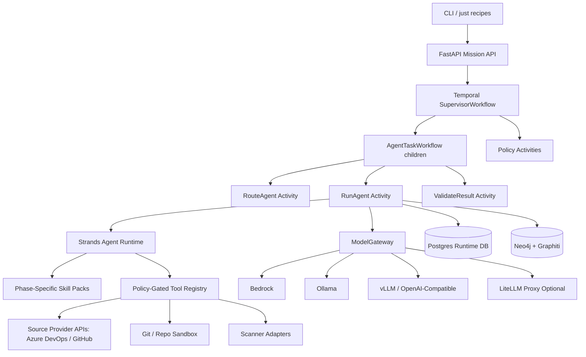

# Initial Implementation Plan for `ado-swarm`

**Author:** Manus AI  
**Date:** 2026-05-31  
**Repository reviewed:** [`X-McKay/ado-swarm`](https://github.com/X-McKay/ado-swarm)  
**Status:** Review draft; no repository files have been created or pushed yet.

## 1. Executive summary

The selected `X-McKay/ado-swarm` repository is currently empty, which makes this a greenfield implementation. The recommended v1 should establish a **Python-first, provider-neutral agent runtime** with a strong developer experience from day one, rather than starting by implementing all remediation behaviors. The first repository milestone should create the scaffold, quality gates, contracts, local Docker environment, and one end-to-end Temporal mission path that executes a static or stubbed plan. This creates a reliable base for later Azure DevOps and GitHub security-ticket processing, Strands skill packs, and remediation workflows.

The central architectural recommendation is to treat **Temporal as the durable control plane** and the **agent swarm as the cognitive execution layer**. Temporal should decide what runs, when it runs, how retries and timeouts work, where approval gates occur, and how progress is queried. Agents should decide how to reason, which skills to activate, which tools to request, and what evidence to produce. This separation matches the attached Temporal design document and Temporal’s Python SDK model of Workflows, Activities, Workers, and Clients.[1]

For storage, the v1 should use **Postgres for structured runtime state** and **Neo4j plus Graphiti for relationship-rich, temporally aware knowledge memory**. Postgres should hold mission runs, plan versions, task events, artifacts, casefiles, audit records, and blackboard entries. Neo4j and Graphiti should hold graph memory about tickets, repositories, findings, files, packages, code locations, duplicate clusters, remediation campaigns, PR outcomes, and long-term learning. Graphiti requires Python 3.10+ and Neo4j 5.26+ or FalkorDB, uses Neo4j connection environment variables, and models its primary ingest unit as an episode.[2]

The development environment should use **mise**, **uv**, **just**, **prek**, **ruff**, **ty**, pytest, and standard pre-commit hooks. `mise.toml` should pin runtime tools. `uv` should own Python dependency resolution, virtual environment synchronization, lockfile reproducibility, and command execution. `justfile` should provide the developer command surface. `.pre-commit-config.yaml` should remain compatible with pre-commit while `prek` is the preferred fast runner. Ruff should own formatting, import sorting, and linting; ty should be the fast local type checker, with room to add pyright or mypy later if CI needs a stricter second opinion.[3] [4] [5] [6] [7] [8]

The model layer should expose a single internal **ModelGateway** interface with runtime profiles for `bedrock`, `ollama`, `openai_compatible`, and optionally `litellm_proxy`. This keeps the repository easy to test locally with Ollama, easy to run against a vLLM OpenAI-compatible endpoint, and easy to promote to Bedrock in AWS or a managed cluster. Strands supports native Bedrock and Ollama providers, an OpenAI provider for OpenAI-compatible endpoints, and a LiteLLM provider for a broad provider matrix.[9] [10] [11] [12] [13]

The first implementation should **not** attempt broad autonomous remediation. It should instead build a durable skeleton that can run read-only triage and evidence gathering, then progressively add safe draft-PR generation under explicit policy and human approval gates. This follows the security-swarm document’s direction: prioritize normalization, stale detection, duplicate grouping, false-positive review, risk classification, planning, evidence, and auditability before broad autonomous changes.

## 2. Design principles and non-negotiable constraints

The v1 repository should be opinionated, small enough to finish, and designed so later remediation capabilities can be added without replacing the foundation. The implementation should preserve deterministic workflow boundaries, strict tool policies, and explicit state contracts from the start.

| Principle | Recommendation | Consequence for implementation |
|---|---|---|
| Temporal is the control plane | Keep workflow code deterministic and compact. Run LLM calls, database queries, HTTP calls, graph writes, MCP calls, Git operations, and shell commands only in Activities. | Workflow modules should import only contracts and Temporal-safe code. Activity modules own I/O. |
| Agents are cognitive workers | Agents receive `AgentInvocation` inputs, activate skills, call approved tools, and return `AgentResult`. | Agents are isolated behind adapters so Strands can evolve or be swapped. |
| Postgres is the operational source of truth | Store runs, plans, events, audit metadata, casefiles, and blackboard entries in Postgres. | Use SQL migrations from the first milestone. Do not store large mutable content in Temporal history. |
| Neo4j+Graphiti is long-term knowledge | Store relationships, duplicate clusters, repository/finding graphs, evidence provenance, and learned remediation patterns in Graphiti. | Wrap Graphiti behind a `KnowledgeStore` port and keep Neo4j URI/password configurable. |
| Docker-first but remote-ready | Local Compose runs Temporal, app Postgres, Neo4j, optional Ollama, API, and workers. All service locations come from environment variables. | Switching to Temporal Cloud, RDS, AuraDB, Bedrock, or cluster LLM endpoints should be configuration-only where possible. |
| Read-only first | MVP should normalize tickets, investigate repos, detect stale/duplicates, score risk, and produce plans before executing changes. | Executor tools should be present as interfaces/stubs early but disabled by policy until a later milestone. |
| Skills are procedures, tools are actions | Strands skills should encode task-level procedures. Tools should perform bounded atomic operations. | `allowed-tools` in skills is treated as documentation only; runtime enforcement belongs in policy/tool adapters. |
| Auditability is a product feature | Every mission, plan version, skill activation, tool call, model call, graph write, and disposition should be reconstructable. | Use structured event tables and include activated skills in `AgentResult`/audit records. |

> The most important implementation rule is that **Temporal should not perform reasoning or side effects directly**. It should schedule and govern side-effecting Activities, while Activities and adapters perform non-deterministic work.

## 3. Recommended architecture

The repository should be organized around **ports and adapters** so local Docker services, remote hosted services, and future framework changes can be swapped without rewriting workflows. The core domain should define contracts, policies, and orchestration-independent logic. Temporal workflows should depend on the contracts, and Activities should use adapters for LLMs, databases, tools, Strands, ADO, Git, and Graphiti.



The local default should use Docker Compose. Remote deployment should use the same environment variable names, with secrets provided by the host platform. The design should avoid hardcoding `localhost`, credentials, model IDs, Temporal namespaces, task queues, or Neo4j database names.

### 3.1 Source-provider abstraction for Azure DevOps and GitHub

The platform should not encode Azure DevOps as the only source of tickets, repositories, pull requests, or comments. Instead, it should define provider-neutral ports for **issues/work items**, **repositories**, **branches**, **files**, **pull requests**, **comments**, and **security findings**, then implement Azure DevOps and GitHub adapters behind those ports. Azure DevOps and GitHub use different vocabulary and API shapes, but the agent workflow should operate on canonical domain contracts.

| Capability | Provider-neutral port | Azure DevOps adapter | GitHub adapter | Canonical output |
|---|---|---|---|---|
| Ticket retrieval | `IssueProvider.get_item()` | Work Items REST API | Issues REST/GraphQL API | `SourceIssue` |
| Ticket search | `IssueProvider.search_items()` | WIQL/search adapter | Issues search / GraphQL query | `SourceIssuePage` |
| Ticket comments | `IssueProvider.add_comment()` | Work item discussion/comment API | Issue comment API | `ProviderMutationResult` |
| Repository metadata | `RepoProvider.get_repository()` | Azure Repos API | GitHub repository API | `SourceRepository` |
| File read | `RepoProvider.get_file()` | Azure Repos item API | GitHub contents or Git data API | `SourceFile` |
| Git clone URL | `RepoProvider.get_clone_url()` | Azure Repos clone URL | GitHub clone URL | `CloneTarget` |
| Pull request creation | `PullRequestProvider.create_draft_pr()` | Azure Repos PR API where draft support is available or policy-labeled PR fallback | GitHub draft pull request API | `SourcePullRequest` |
| PR comments/status | `PullRequestProvider.add_comment()` / `set_status()` | Azure Repos PR threads/status | GitHub review comments/checks/statuses | `ProviderMutationResult` |
| Security alerts | `SecurityFindingProvider.list_findings()` | ADO security tickets or extension-specific ingestion | GitHub code scanning / Dependabot / secret scanning adapters | `ProviderFinding` |

The implementation should use an internal `SourceProviderKind` enum with values such as `azure_devops`, `github`, and `stub`. The first Docker and CI tests should use the `stub` provider so no external credentials are required. Real provider credentials should be configured per provider through environment variables, such as `ADO_ORG_URL`, `ADO_PROJECT`, `ADO_PAT`, `GITHUB_TOKEN`, `GITHUB_OWNER`, and `GITHUB_APP_*`.


## 4. Repository scaffold and directory structure

The repository should start with the following structure. This layout intentionally separates contracts, domain logic, Temporal orchestration, Activities, adapters, skills, policy, tests, examples, and documentation. It also leaves room for `.claude/skills` compatibility without making Claude Code the runtime dependency.

```text
ado-swarm/
  README.md
  LICENSE
  pyproject.toml
  uv.lock
  mise.toml
  justfile
  .env.example
  .gitignore
  .pre-commit-config.yaml
  Dockerfile
  docker-compose.yml
  docker-compose.ollama.yml
  docker-compose.vllm.yml
  docs/
    architecture.md
    implementation-plan.md
    decisions/
      ADR-0001-temporal-control-plane.md
      ADR-0002-model-gateway.md
      ADR-0003-postgres-and-graphiti-memory.md
    operations/
      local-development.md
      remote-services.md
      model-provider-switching.md
      security-and-governance.md
  src/
    ado_swarm/
      __init__.py
      api/
        __init__.py
        app.py
        routes_missions.py
        routes_health.py
        schemas.py
      contracts/
        __init__.py
        artifacts.py
        casefile.py
        source_provider.py
        mission.py
        planning.py
        agents.py
        approvals.py
        events.py
      domain/
        __init__.py
        plan_validation.py
        risk_policy.py
        idempotency.py
        dispositions.py
      workflows/
        __init__.py
        supervisor.py
        agent_task.py
      activities/
        __init__.py
        planning.py
        routing.py
        run_agent.py
        validation.py
        policy.py
        knowledge.py
        audit.py
      agents/
        __init__.py
        base.py
        registry.py
        loader.py
        schemas.py
        strands_runtime.py
        qa_lead/
          __init__.py
          main.py
          metadata.yaml
          eval.py
          prompts.md
        ticket_analyst/
          __init__.py
          main.py
          metadata.yaml
          eval.py
          prompts.md
        repo_analyst/
          __init__.py
          main.py
          metadata.yaml
          eval.py
          prompts.md
        security_reviewer/
          __init__.py
          main.py
          metadata.yaml
          eval.py
          prompts.md
        risk_auditor/
          __init__.py
          main.py
          metadata.yaml
          eval.py
          prompts.md
        solutions_architect/
          __init__.py
          main.py
          metadata.yaml
          eval.py
          prompts.md
        software_engineer/
          __init__.py
          main.py
          metadata.yaml
          eval.py
          prompts.md
        test_engineer/
          __init__.py
          main.py
          metadata.yaml
          eval.py
          prompts.md
        data_analyst/
          __init__.py
          main.py
          metadata.yaml
          eval.py
          prompts.md
      skills/
        packs/
          triage-readonly.txt
          repository-investigation.txt
          adjudication.txt
          risk-impact.txt
          planning.txt
          remediation.txt
          validation-submission.txt
          analytics.txt
        security-ticket-normalization/
          SKILL.md
          references/
        repository-resolution/
          SKILL.md
          references/
        stale-finding-adjudication/
          SKILL.md
          references/
      tools/
        __init__.py
        registry.py
        policy.py
        source_providers/
          __init__.py
          base.py
          schemas.py
          stub.py
          azure_devops.py
          github.py
        git_repo.py
        repo_search.py
        scanners.py
        dependency.py
        test_build.py
        sandbox.py
      storage/
        __init__.py
        postgres.py
        migrations.py
        blackboard.py
        artifacts.py
        events.py
        casefiles.py
      knowledge/
        __init__.py
        graphiti_store.py
        neo4j_health.py
        schemas.py
        episodes.py
      model_gateway/
        __init__.py
        config.py
        gateway.py
        strands_models.py
        litellm_gateway.py
      observability/
        __init__.py
        logging.py
        tracing.py
        metrics.py
      workers/
        __init__.py
        supervisor_worker.py
        agent_worker.py
        tool_worker.py
      cli/
        __init__.py
        main.py
  migrations/
    0001_runtime_schema.sql
    0002_casefile_schema.sql
  examples/
    missions/
      stale_deleted_file.json
      dependency_vulnerability.json
      risky_sast_issue.json
    tickets/
      sample_provider_issue.json
  tests/
    unit/
      test_contracts.py
      test_plan_validation.py
      test_model_gateway_config.py
      test_tool_policy.py
    workflow/
      test_supervisor_workflow.py
      test_agent_task_workflow.py
    integration/
      test_postgres_blackboard.py
      test_graphiti_store.py
      test_temporal_smoke.py
    e2e/
      test_static_mission_local.py
  .github/
    workflows/
      ci.yml
  .claude/
    skills/
      ado-swarm-development/
        SKILL.md
        references/
```

The `src/ado_swarm/agents` directory should be structured as an **agent catalog**, where every agent lives in its own directory and exposes the same local development surface: `main.py` for the runnable agent implementation, `metadata.yaml` for discoverability and registry loading, `eval.py` for isolated evaluation, and optional prompt/reference files. This makes the currently available agents obvious to developers, allows each agent to be iterated independently, and still supports a common base class and standardized runtime conventions. The `src/ado_swarm/skills` directory should contain runtime Strands Agent Skills used by the application. The `.claude/skills` directory should contain development-support skills for humans and coding agents that work on the repository. These are related but distinct: runtime skills guide production agents, while development skills guide maintainers.

## 5. Development tooling plan

The developer experience should make the correct path obvious. A new developer should be able to run `mise trust`, `mise install`, `just setup`, `just up`, `just smoke`, and `just check` without needing to know the internals.

### 5.1 `mise.toml`

`mise` should pin the major tools used locally. The documentation states that mise can manage Python versions and integrate with uv for virtual environment creation.[4]

```toml
[tools]
python = "3.12"
uv = "latest"
just = "latest"
prek = "latest"
ruff = "latest"
ty = "latest"
node = "22"
jq = "latest"
yq = "latest"

[env]
_.file = ".env"
_.python.venv = { path = ".venv", create = true, uv_create_args = ["--seed"] }
PYTHONPATH = "src"

[tasks.setup]
description = "Install Python dependencies and Git hooks"
run = "uv sync --all-extras --dev && prek install"
```

This should be treated as the local developer runtime declaration, while `pyproject.toml` and `uv.lock` remain the Python dependency source of truth.

### 5.2 `pyproject.toml`

`uv` should manage the project. Its documentation describes project dependencies, environments, lockfiles, tool execution, and workspaces.[3] The initial dependency set should be intentionally practical rather than maximal.

| Group | Initial packages | Purpose |
|---|---|---|
| Runtime | `fastapi`, `uvicorn`, `pydantic`, `pydantic-settings`, `temporalio`, `asyncpg`, `sqlalchemy`, `alembic`, `neo4j`, `graphiti-core`, `strands-agents`, `strands-agents-tools`, `httpx`, `tenacity`, `orjson`, `structlog`, `opentelemetry-api` | API, Temporal, database access, graph memory, agent runtime, HTTP integrations, structured logging. |
| Model extras | `litellm`, `openai`, `boto3`, `ollama` | Provider-specific support for Bedrock, OpenAI-compatible endpoints, LiteLLM, and Ollama. |
| Development | `pytest`, `pytest-asyncio`, `pytest-cov`, `testcontainers`, `ruff`, `ty`, `prek`, `freezegun`, `respx`, `faker` | Tests, lint, type checking, hook running, mocks, deterministic time, HTTP mocking. |
| Future optional | `mcp`, A2A SDK package when selected, Azure DevOps SDK if preferred over REST | Tool/resource integration and external agent interoperability. |

The initial `pyproject.toml` should configure Ruff and ty centrally. Ruff is documented as a linter and formatter with `pyproject.toml` support and drop-in parity with Flake8, isort, and Black.[7] Ty is documented as a fast Python type checker that runs with `ty check` and discovers project files from `pyproject.toml`.[8]

```toml
[project]
name = "ado-swarm"
version = "0.1.0"
description = "Temporal-orchestrated agent swarm for Azure DevOps and GitHub security remediation workflows"
requires-python = ">=3.12"
readme = "README.md"

[tool.uv]
package = true

[tool.ruff]
target-version = "py312"
line-length = 100
src = ["src", "tests"]

[tool.ruff.lint]
select = ["E", "F", "I", "B", "UP", "SIM", "RUF", "TID", "N", "ASYNC", "S"]
ignore = [
  "S101" # allow assert in tests; narrow with per-file ignores later
]

[tool.ruff.lint.per-file-ignores]
"tests/**/*.py" = ["S101"]

[tool.ruff.format]
quote-style = "double"
indent-style = "space"

[tool.ty]
# Start practical; tighten after contracts stabilize.
```

### 5.3 `justfile`

The just manual describes just as a command runner with recipes, arguments, `.env` loading, and invocation from subdirectories.[6] The `justfile` should be the canonical command surface.

```just
set dotenv-load := true
set shell := ["bash", "-eu", "-o", "pipefail", "-c"]

_default:
  just --list

setup:
  uv sync --all-extras --dev
  prek install

format:
  uv run ruff format src tests
  uv run ruff check --fix src tests

lint:
  uv run ruff check src tests

typecheck:
  uv run ty check

test:
  uv run pytest tests/unit tests/workflow

test-integration:
  uv run pytest tests/integration

eval-agent agent:
  uv run python -m ado_swarm.agents.{{agent}}.eval --model-profile fake --output .artifacts/evals/{{agent}}.json

eval-agents:
  uv run python -m ado_swarm.cli.main eval agents --model-profile fake --output .artifacts/evals/agents.json

check: lint typecheck test

up:
  docker compose up -d --build

down:
  docker compose down

reset:
  docker compose down -v
  docker compose up -d --build

logs service="":
  if [ -z "{{service}}" ]; then docker compose logs -f; else docker compose logs -f {{service}}; fi

migrate:
  uv run python -m ado_swarm.storage.migrations apply

worker-supervisor:
  uv run python -m ado_swarm.workers.supervisor_worker

worker-agent:
  uv run python -m ado_swarm.workers.agent_worker

api:
  uv run uvicorn ado_swarm.api.app:app --reload --host 0.0.0.0 --port 8000

smoke:
  uv run python -m ado_swarm.cli.main smoke

mission goal:
  uv run python -m ado_swarm.cli.main mission start "{{goal}}"
```

The final syntax should be validated in implementation, but the command taxonomy is the important design decision.

### 5.4 `prek` and `.pre-commit-config.yaml`

`pre-commit` is widely used and configured with `.pre-commit-config.yaml`; `prek` is a faster drop-in alternative compatible with pre-commit configurations and integrates with uv.[5] [6] The repository should use `.pre-commit-config.yaml` for ecosystem compatibility and run it through `prek` locally.

```yaml
minimum_pre_commit_version: "4.0.0"
default_install_hook_types: [pre-commit, pre-push]
default_stages: [pre-commit]

repos:
  - repo: https://github.com/pre-commit/pre-commit-hooks
    rev: v5.0.0
    hooks:
      - id: check-added-large-files
      - id: check-ast
      - id: check-json
      - id: check-toml
      - id: check-yaml
      - id: debug-statements
      - id: end-of-file-fixer
      - id: trailing-whitespace
      - id: mixed-line-ending

  - repo: https://github.com/astral-sh/ruff-pre-commit
    rev: v0.11.0
    hooks:
      - id: ruff
        args: [--fix]
      - id: ruff-format

  - repo: local
    hooks:
      - id: ty
        name: ty check
        entry: uv run ty check
        language: system
        pass_filenames: false
        stages: [pre-push]
      - id: pytest-unit
        name: pytest unit
        entry: uv run pytest tests/unit tests/workflow
        language: system
        pass_filenames: false
        stages: [pre-push]
```

## 6. Docker-first local environment and remote-service switchability

The first Compose stack should run the platform locally with minimal external dependencies. It should include Temporal, a Temporal persistence database, the app Postgres database, Neo4j, the API, supervisor worker, agent worker, and tool worker. Ollama and vLLM should be optional overlays because local model hosting can be hardware-specific.

| Service | Local default | Remote equivalent | Switch mechanism |
|---|---|---|---|
| Temporal | `temporalio/auto-setup` plus Postgres | Temporal Cloud or shared Temporal cluster | `TEMPORAL_ADDRESS`, `TEMPORAL_NAMESPACE`, TLS/API-key settings |
| Runtime Postgres | `postgres:16` | RDS, Cloud SQL, Neon, Crunchy, Supabase, homelab Postgres | `DATABASE_URL` |
| Neo4j | `neo4j:5.26+` | Neo4j AuraDB or cluster Neo4j | `NEO4J_URI`, `NEO4J_USER`, `NEO4J_PASSWORD`, `NEO4J_DATABASE` |
| Graphiti | In-process library in workers | Same library with remote Neo4j | Graphiti config environment |
| LLM | Ollama overlay or OpenAI-compatible vLLM overlay | Bedrock, vLLM ingress, LiteLLM proxy, managed OpenAI-compatible endpoint | `MODEL_PROVIDER`, `MODEL_ID`, `MODEL_BASE_URL`, provider secrets |
| Artifacts | Local filesystem volume initially | S3, MinIO, Azure Blob | `ARTIFACT_STORE_KIND`, bucket/container variables |

The local `docker-compose.yml` should avoid embedding production-like secrets. `.env.example` should include explicit defaults and comments.

```yaml
services:
  temporal-db:
    image: postgres:16
    environment:
      POSTGRES_USER: temporal
      POSTGRES_PASSWORD: temporal
      POSTGRES_DB: temporal
    volumes:
      - temporal-db:/var/lib/postgresql/data

  temporal:
    image: temporalio/auto-setup:latest
    depends_on: [temporal-db]
    ports:
      - "7233:7233"
    environment:
      DB: postgres12
      DB_PORT: "5432"
      POSTGRES_USER: temporal
      POSTGRES_PWD: temporal
      POSTGRES_SEEDS: temporal-db

  app-db:
    image: postgres:16
    ports:
      - "5432:5432"
    environment:
      POSTGRES_USER: ado_swarm
      POSTGRES_PASSWORD: ado_swarm
      POSTGRES_DB: ado_swarm
    volumes:
      - app-db:/var/lib/postgresql/data

  neo4j:
    image: neo4j:5.26
    ports:
      - "7474:7474"
      - "7687:7687"
    environment:
      NEO4J_AUTH: neo4j/ado_swarm_dev_password
      NEO4J_PLUGINS: '["apoc"]'
    volumes:
      - neo4j-data:/data
      - neo4j-logs:/logs

  api:
    build: .
    command: uv run uvicorn ado_swarm.api.app:app --host 0.0.0.0 --port 8000
    ports:
      - "8000:8000"
    env_file: .env
    depends_on: [temporal, app-db, neo4j]

  supervisor-worker:
    build: .
    command: uv run python -m ado_swarm.workers.supervisor_worker
    env_file: .env
    depends_on: [temporal, app-db]

  agent-worker:
    build: .
    command: uv run python -m ado_swarm.workers.agent_worker
    env_file: .env
    depends_on: [temporal, app-db, neo4j]

volumes:
  temporal-db:
  app-db:
  neo4j-data:
  neo4j-logs:
```

The `docker-compose.ollama.yml` overlay should add Ollama and set `MODEL_PROVIDER=ollama`, while `docker-compose.vllm.yml` should document an OpenAI-compatible endpoint shape but may not be enabled by default unless GPU support exists. Strands’ Ollama documentation includes Docker usage and port `11434`, while Strands’ OpenAI provider supports a custom `base_url` for OpenAI-compatible servers.[12] [10]

## 7. Core runtime contracts

The initial implementation should define Pydantic contracts before implementing behavior. These contracts are the seam between API, workflows, activities, storage, agents, and tests. They should be versioned carefully because Temporal histories and database rows may outlive code deployments.

| Contract | Purpose | Stored in Temporal? | Stored in Postgres? |
|---|---|---:|---:|
| `RunStatus` | Mission lifecycle status. | Yes | Yes |
| `TaskState` | Child task lifecycle status. | Yes | Yes |
| `RiskLevel` | Policy and approval classification. | Yes | Yes |
| `ArtifactRef` | Pointer to artifact content outside Temporal. | Yes, as ref | Yes |
| `MemoryRef` | Pointer to blackboard, graph, vector, or trace memory. | Yes, as ref | Yes |
| `TaskSpec` | Durable unit of work in a plan. | Yes | Yes |
| `PlanVersion` | Immutable plan snapshot and lineage. | Yes, compact | Yes, full JSON |
| `TaskEvent` | Progress and audit event. | Recent/summarized | Yes, full timeline |
| `RunSnapshot` | Queryable current state. | Yes | Derived/persisted |
| `AgentCard` | Agent capability metadata. | No | Yes/config |
| `AgentInvocation` | Activity-to-agent request. | Activity payload | Optional audit |
| `AgentResult` | Agent output and follow-up proposal. | Yes, compact | Yes |
| `ApprovalRequest` | Human/policy gate request. | Yes | Yes |
| `ApprovalDecision` | Human/policy gate result. | Yes | Yes |
| `Casefile` | Canonical security-ticket working record. | Ref only | Yes |

The casefile schema should be separate from generic mission contracts because it is domain-specific to Azure DevOps and GitHub security remediation. It should be possible to run non-security missions through the same runtime later, but security remediation needs a rich canonical record.

```python
class SecurityCasefile(BaseModel):
    casefile_id: str
    run_id: str
    source_issue: SourceIssue
    normalized_finding: NormalizedFinding
    repository_evidence: RepositoryEvidence | None = None
    adjudication: FindingAdjudication | None = None
    risk: RiskClassification | None = None
    impact: ChangeImpactClassification | None = None
    remediation_plan: RemediationPlan | None = None
    execution: ExecutionResult | None = None
    validation: ValidationResult | None = None
    submission: SubmissionResult | None = None
    audit: AuditEnvelope
    final_disposition: Literal[
        "open",
        "stale",
        "duplicate",
        "false_positive",
        "needs_human",
        "draft_pr_created",
        "ready_for_review",
        "closed_with_evidence",
    ]
```

The initial implementation should include JSON examples for the three worked cases in the user’s source document: stale file deleted, dependency vulnerability with draft PR, and valid SAST issue too risky for automation.

The provider-neutral source contracts should preserve provider-native IDs while giving agents a single vocabulary. A GitHub issue, a GitHub security alert, and an Azure DevOps work item should all become a `SourceIssue` or `ProviderFinding` with a `provider` field, an immutable `external_id`, a web URL, and normalized fields. Provider-specific fields should be retained under `provider_payload` for auditability, but agents should reason over normalized fields by default.

```python
class SourceProviderKind(StrEnum):
    AZURE_DEVOPS = "azure_devops"
    GITHUB = "github"
    STUB = "stub"

class SourceIssue(BaseModel):
    provider: SourceProviderKind
    external_id: str
    url: str
    title: str
    body: str | None = None
    state: str
    labels: list[str] = Field(default_factory=list)
    repository: SourceRepositoryRef | None = None
    created_at: datetime
    updated_at: datetime
    provider_payload: dict[str, Any] = Field(default_factory=dict)

class SourceRepositoryRef(BaseModel):
    provider: SourceProviderKind
    external_id: str
    owner_or_project: str
    name: str
    default_branch: str | None = None
    clone_url: str | None = None
    web_url: str | None = None

class SourcePullRequest(BaseModel):
    provider: SourceProviderKind
    external_id: str
    url: str
    title: str
    source_branch: str
    target_branch: str
    is_draft: bool = True
    provider_payload: dict[str, Any] = Field(default_factory=dict)
```


## 8. Temporal workflow implementation plan

The first runnable implementation should include `SupervisorWorkflow` and `AgentTaskWorkflow`. It should be intentionally boring and testable. The workflow should start from a goal or casefile request, call a planner Activity, validate the plan, start child workflows for runnable tasks, track task state, respond to queries, and persist references to Postgres through Activities.

| Component | v1 responsibility | Non-responsibility |
|---|---|---|
| `SupervisorWorkflow` | Own run state, plan version number, task graph status, approval wait states, cancellation flag, and query snapshot. | No LLM calls, DB calls, HTTP calls, file reads, shell commands, or graph queries. |
| `AgentTaskWorkflow` | Own task routing, task-level retry, run-agent Activity invocation, result validation, and child task completion state. | No direct agent reasoning or tool execution. |
| `PlanMissionActivity` | Create a static or LLM-backed plan, depending on milestone. | No durable orchestration. |
| `RouteAgentActivity` | Select agent/task queue based on capability, risk, and trust zone. | No execution. |
| `RunAgentActivity` | Invoke Strands runtime or a stub agent, record activated skills, emit audit events, and return `AgentResult`. | No workflow state mutation except through returned result and event APIs. |
| `PolicyCheckActivity` | Decide whether a task or tool call needs approval. | No human waiting loop. |
| `ValidateResultActivity` | Check schema, acceptance criteria, evidence, policy compliance, and idempotency. | No remediation execution. |

The workflow tests should use Temporal’s Python testing support. Temporal’s developer guide explicitly includes testing, retries, workflow message passing, child workflows, observability, and versioning as Python SDK topics.[1]

## 9. Strands Agent Skills and runtime skill management

The security-swarm design should use Strands Agent Skills to avoid a giant monolithic prompt. Strands documentation states that skills provide on-demand specialized instructions; the `AgentSkills` plugin uses progressive disclosure by injecting lightweight metadata into the system prompt while loading full instructions only when the agent activates a skill through the `skills` tool.[14]

> Strands documentation: “Skills give your agent on-demand access to specialized instructions without bloating the system prompt.”[14]

The documentation also states that the metadata XML is refreshed before each invocation, runtime changes through `set_available_skills` / `setAvailableSkills` take effect on the next invocation, and activated skills are tracked in agent state.[14] This directly supports phase-specific skill packs and audit logging.

### 9.1 Skill packs

| Skill pack | Loaded for | Initial skills |
|---|---|---|
| `triage-readonly` | Ticket intake and initial normalization | `security-ticket-normalization`, `finding-type-classification`, `scanner-finding-fingerprinting` |
| `repository-investigation` | Repo/file/package evidence gathering | `repository-resolution`, `code-location-verification`, `git-history-investigation` |
| `adjudication` | Stale, duplicate, and false-positive review | `stale-finding-adjudication`, `duplicate-finding-adjudication`, `false-positive-evidence-review` |
| `risk-impact` | Risk and change impact analysis | `security-risk-scoring`, `change-impact-classification`, `automation-eligibility-assessment` |
| `planning` | Remediation planning | `remediation-strategy-selection`, `fix-plan-generation`, `safe-change-boundary-definition` |
| `remediation` | Controlled code/package/IaC changes | `dependency-remediation-execution`, `localized-code-remediation-execution`, `iac-remediation-execution` |
| `validation-submission` | Diff review, tests, PR prep, ticket updates | `remediation-diff-review`, `security-fix-verification`, `test-and-build-validation`, `pull-request-preparation`, `ticket-disposition-update` |
| `analytics` | Learning loop and campaign discovery | `false-positive-pattern-mining`, `campaign-discovery`, `skill-performance-evaluation` |

For v1, the MVP should implement the first four packs plus planning. The remediation and submission packs should exist as directories and contracts but remain policy-disabled until later milestones. This makes the codebase structure stable without prematurely enabling risky behavior.

### 9.2 Runtime skill management pseudocode

```python
from strands import Agent
from strands.models.openai import OpenAIModel
from strands_tools import calculator
from ado_swarm.agents.skills import load_skill_pack, record_skill_audit

async def run_phase_agent(invocation: AgentInvocation, phase: str) -> AgentResult:
    model = build_strands_model_from_profile(invocation.model_profile)
    plugin = AgentSkills(skills=load_skill_pack(phase), strict=True)
    agent = Agent(model=model, plugins=[plugin], tools=build_tools_for_phase(phase))

    available = await plugin.get_available_skills()
    await emit_event(
        run_id=invocation.run_id,
        task_id=invocation.task.task_id,
        event_type="skills.available",
        metadata={"skills": [skill.name for skill in available], "phase": phase},
    )

    if invocation.task.constraints.get("temporary_skill"):
        plugin.set_available_skills([*available, invocation.task.constraints["temporary_skill"]])

    if invocation.task.constraints.get("replace_skill_pack"):
        plugin.set_available_skills(load_skill_pack(invocation.task.constraints["replace_skill_pack"]))

    response = await agent.invoke_async(render_agent_prompt(invocation))
    activated = plugin.get_activated_skills(agent)
    await record_skill_audit(invocation, available, activated)

    return parse_agent_result(response, activated_skills=activated)
```

The exact Python API names should be confirmed during implementation because the extracted page displayed TypeScript examples while describing Python/TypeScript equivalents. The design requirement is clear: list available skills, add or replace the skill set at runtime, inspect activated skills, and persist activated-skill data into the task audit timeline.

### 9.3 Skill metadata is not enforcement

Strands documentation says `allowed-tools` is currently informational and is not enforced at runtime.[14] Therefore, every tool call must pass through a runtime `ToolPolicy` layer. A skill may declare `allowed-tools: provider_get_issue git_clone_or_fetch`, but the system must enforce that independently using task phase, agent identity, trust zone, approval state, repository allowlist, provider kind, and operation risk.

## 10. Agent catalog for v1

The v1 agent set should remain under ten agents, consistent with the attached security-swarm prompt, but the names should be easy for software and security engineers to understand at a glance. Agent implementations should be thin, standardized modules that inherit from a shared base agent and declare their identity, version, tools, skills, risk tier, and evaluation entrypoints in metadata. The first implementation can stub most agent behavior while preserving contract boundaries.

### 10.1 Agent directory standard

Each agent should live under `src/ado_swarm/agents/<agent_name>/` and use the same file convention. The registry should discover agents by reading each `metadata.yaml`, validating it with a Pydantic schema, and importing the agent’s `main.py` only when the agent is selected. This keeps catalog discovery lightweight and makes it easy for developers to work on one agent at a time.

| File | Required | Purpose |
|---|---:|---|
| `main.py` | Yes | Exposes the agent implementation, typically a `build_agent()` factory and a `run(invocation)` entrypoint that uses the shared base agent. |
| `metadata.yaml` | Yes | Defines the agent’s display name, stable ID, version, description, owner, maturity, supported capabilities, tool policy, skill packs, direct skills, model profile defaults, and eval command. |
| `eval.py` | Yes | Runs isolated agent evaluations against golden casefiles or synthetic fixtures and emits structured metrics. |
| `prompts.md` | Recommended | Contains the stable system prompt and any local prompt fragments that are not better represented as Strands skills. |
| `fixtures/` | Optional | Contains agent-specific evaluation inputs and expected outputs. |
| `README.md` | Optional | Explains local development notes for complex agents. |

A representative agent directory should look like this:

```text
src/ado_swarm/agents/risk_auditor/
  __init__.py
  main.py
  metadata.yaml
  eval.py
  prompts.md
  fixtures/
    valid_sast_high_risk.json
    dependency_low_risk.json
```

The metadata file should be explicit enough to serve as both developer documentation and runtime registry input. Tool access declared in metadata is still not sufficient for enforcement by itself; the runtime `ToolPolicy` layer remains authoritative.

```yaml
id: risk_auditor
name: Risk Auditor
version: 0.1.0
description: Scores security risk, business impact, and automation eligibility for normalized findings.
role: security_risk_reviewer
maturity: experimental
owner: security-platform
entrypoint: ado_swarm.agents.risk_auditor.main:build_agent
eval_entrypoint: ado_swarm.agents.risk_auditor.eval:run_eval
capabilities:
  - security-risk-scoring
  - change-impact-classification
  - automation-eligibility-assessment
skill_packs:
  - risk-impact
skills:
  - security-risk-scoring
  - change-impact-classification
  - automation-eligibility-assessment
tools:
  allowed:
    - casefile_read
    - casefile_update_section
    - policy_check_action
    - graphiti_search
    - blackboard_append
  denied:
    - git_write
    - provider_create_draft_pr
    - issue_disposition_update
permissions:
  repositories: read
  casefiles: write:risk,write:impact
  graph: read
  provider_issues: none
model_defaults:
  profile: balanced_reasoning
  temperature: 0.1
risk_tier: medium
human_approval_required_for:
  - high_confidence_auto_remediation_recommendation
  - risk_level_downgrade
outputs:
  schema: RiskClassification
  audit_events:
    - risk.classified
    - automation.eligibility_assessed
```

The base agent should standardize configuration loading, model construction, skill-pack resolution, tool-policy attachment, audit context, structured output parsing, and eval harness integration. Individual agents should mainly define role-specific prompts, output schemas, and small orchestration glue.

### 10.2 Recommended v1 agent names

The following names are more intuitive than the earlier role labels because they align with common software, security, and delivery roles. The stable directory name should be lowercase snake_case, while the display name can be human-friendly.

| Directory | Display name | Replaces earlier name | Purpose | MVP status | Skill packs | Tool access |
|---|---|---|---|---|---|---|
| `qa_lead` | QA Lead | Backlog Orchestrator | Select tickets/campaigns, coordinate mission intake, track casefile quality, and decide when a run is ready for the next phase. | Stub/API-driven in MVP | `triage-readonly`, `analytics` later | Provider issue read, Postgres read/write |
| `ticket_analyst` | Ticket Analyst | Ticket Intake | Normalize provider issue/work-item fields into canonical findings and identify missing ticket evidence. | Implement first | `triage-readonly` | Provider issue/work-item read, casefile write |
| `repo_analyst` | Repository Analyst | Repository Investigator | Resolve repo/branch/path, verify code locations, inspect history, and gather read-only repository evidence. | Implement second | `repository-investigation` | Provider repo read, Git read, repo search |
| `security_reviewer` | Security Reviewer | Finding Adjudicator | Determine whether a finding is stale, duplicate, already fixed, or likely false positive, with evidence. | Implement third | `adjudication` | Git read, scanners read, Graphiti read/write |
| `risk_auditor` | Risk Auditor | Risk and Impact Classifier | Score security risk, change impact, confidence, and automation eligibility. | Implement third | `risk-impact` | Casefile read/write, policy read, Graphiti read |
| `solutions_architect` | Solutions Architect | Remediation Planner | Produce bounded remediation strategies, change boundaries, and implementation plans. | Implement fourth | `planning` | Casefile read/write, repo read |
| `software_engineer` | Software Engineer | Remediation Executor | Apply low-risk code, dependency, or IaC changes in an isolated sandbox. | Policy-disabled until later | `remediation` | Git write in sandbox only, dependency tools |
| `test_engineer` | Test Engineer | Validation and Submission | Review diffs, run tests/scanners, prepare draft PRs, and update tickets after approval. | Later, draft-only | `validation-submission` | Test/build, provider PR draft, provider comments |
| `data_analyst` | Data Analyst | Learning and Analytics | Mine false-positive patterns, duplicate campaigns, throughput metrics, and skill effectiveness. | Later | `analytics` | Postgres/Graphiti analytics read/write |

This naming scheme keeps each agent understandable to developers who have never seen the architecture document. It also leaves room for future specialist agents such as `dependency_engineer`, `cloud_security_reviewer`, or `appsec_engineer` if the initial `software_engineer` becomes too broad.

### 10.3 Agent evaluation convention

Every `eval.py` should support the same minimal interface so agent quality can be measured independently and in CI. The command should accept fixture paths, model profile, output path, and a flag for deterministic fake-model mode. This allows developers to run one agent’s evaluations without starting the entire swarm.

```bash
uv run python -m ado_swarm.agents.risk_auditor.eval \
  --fixtures examples/tickets/risk_auditor \
  --model-profile fake \
  --output .artifacts/evals/risk_auditor.json
```

The standard eval result should include pass/fail status, latency, model profile, activated skills, tool calls requested, output schema validity, expected-vs-actual labels, and regression notes. At the repository level, `just eval-agent risk_auditor` should call the same entrypoint, while `just eval-agents` should run the full catalog.

## 11. Tooling model

Tools should be small, typed, idempotent where possible, and policy-gated. Skills should not wrap single tool calls; they should describe procedures using multiple tools and evidence requirements.

| Tool category | Minimal v1 tools | Azure DevOps implementation | GitHub implementation | Write capability in MVP? |
|---|---|---|---|---:|
| Issue/work-item provider | `provider_get_issue`, `provider_search_issues`, `provider_list_issue_links` | Work Items / WIQL adapter | Issues REST/GraphQL adapter | No |
| Repository provider | `provider_get_repo_metadata`, `provider_list_refs`, `provider_get_file` | Azure Repos adapter | GitHub repository/contents adapter | No |
| Pull request provider | `provider_create_draft_pr`, `provider_add_pr_comment`, `provider_set_pr_status` | Azure Repos PR adapter | GitHub pull request/checks adapter | Draft PR disabled until later |
| Git | `git_clone_or_fetch`, `git_checkout_ref`, `git_log_path`, `git_diff_readonly` | Uses provider clone target | Uses provider clone target | Clone/read only initially |
| Repository search | `repo_find_file`, `repo_grep`, `repo_parse_manifest`, `repo_locate_symbol` | Provider-independent local clone/search | Provider-independent local clone/search | No |
| Scanner | `scanner_parse_existing_result`, `scanner_run_targeted` | Provider-independent with source metadata | Provider-independent with source metadata | Targeted scans only, sandboxed |
| Dependency | `dependency_inspect_manifest`, `dependency_plan_upgrade` | Provider-independent | Provider-independent | Planning only initially |
| Test/build | `test_discover_commands`, `test_run_targeted` | Provider-independent | Provider-independent | Sandbox only |
| Casefile/state | `casefile_read`, `casefile_update_section`, `blackboard_append`, `event_emit` | Application DB | Application DB | Yes, application DB only |
| Knowledge | `graphiti_add_episode`, `graphiti_search`, `neo4j_verify_connectivity` | Provider metadata becomes graph attributes | Provider metadata becomes graph attributes | Yes, graph memory only |
| Policy/audit | `policy_check_action`, `audit_record_tool_call`, `audit_record_skill_activation` | Provider-aware policy context | Provider-aware policy context | Yes |

Every tool should return a structured result with `ok`, `result`, `evidence_refs`, `warnings`, `error_type`, `redactions`, `idempotency_key`, and `audit_metadata`. Tool execution should be denied by default unless the agent, phase, and casefile state allow it.

## 12. Postgres and Graphiti memory design

Postgres should be the authoritative runtime database. Neo4j+Graphiti should be the relationship and learning memory. The two should be connected by IDs, not duplicated wholesale. For example, a Postgres `casefile_id` can correspond to Graphiti episodes and entities labeled with the same ID.

| Data | Postgres | Graphiti / Neo4j |
|---|---|---|
| Mission run status | Primary | Optional episode summary |
| Plan versions | Primary JSONB | Relationships from goal to tasks/campaigns optional |
| Task event stream | Primary | Important summarized episodes only |
| Casefile sections | Primary | Entities/edges for ticket, finding, repo, file, package, campaign |
| Duplicate clusters | Primary cluster metadata | Graph relationships across findings and evidence |
| Evidence provenance | Primary refs and audit metadata | Relationships among ticket, repo, commit, file, scanner result |
| Learning patterns | Aggregated tables | First-class graph memory |
| Large artifacts | Artifact refs | Links/metadata only |

Neo4j’s Python driver documentation recommends creating a `Driver` with a URI and auth token, verifying connectivity, using parameterized Cypher, and closing driver/session resources.[15] Graphiti then sits above Neo4j for temporal context graphs, episodes, hybrid search, and agent memory.[2]

The initial Graphiti adapter should support four operations: `healthcheck`, `add_casefile_episode`, `search_related_findings`, and `record_outcome_episode`. More advanced custom entity/edge types should wait until real sample data clarifies the best ontology.

## 13. Model gateway design

The model gateway should make provider switching explicit and testable. The repository should not scatter Bedrock, Ollama, OpenAI, or LiteLLM configuration across agents. It should define a profile object and a factory that returns the proper Strands model or direct completion client.

```python
class ModelProfile(BaseModel):
    provider: Literal["bedrock", "ollama", "openai_compatible", "litellm", "litellm_proxy"]
    model_id: str
    base_url: str | None = None
    api_key_env: str | None = None
    region: str | None = None
    temperature: float = 0.2
    max_tokens: int = 4096
    timeout_seconds: int = 120
```

| Provider profile | Intended use | Implementation path |
|---|---|---|
| `ollama` | Local CPU/GPU dev and smoke tests. | Strands `OllamaModel` with `host` and `model_id`; optional Compose overlay. |
| `openai_compatible` | vLLM, LM Studio, OpenAI-compatible cluster ingress. | Strands `OpenAIModel` with `base_url`; API key can be dummy if endpoint allows it. |
| `bedrock` | AWS deployment and production-grade managed inference. | Strands `BedrockModel` or LiteLLM Bedrock route. |
| `litellm` | Broad provider flexibility from code. | Strands `LiteLLMModel`. |
| `litellm_proxy` | Centralized provider routing, cost controls, and keys. | Strands `LiteLLMModel` with proxy URL or prefix. |

The Strands documentation supports all of these paths: OpenAI-compatible models through the OpenAI provider, Bedrock through `BedrockModel`, Ollama through `OllamaModel`, and broad provider support through LiteLLM.[9] [10] [11] [12]

## 14. Initial implementation milestones

The implementation should proceed in phases that each leave the repository runnable and tested. The user’s preference for detailed plans, frequent commits, local Docker testing, multi-provider adapter boundaries, and end-to-end verification should be built into the process.

| Milestone | Goal | Deliverables | Acceptance criteria |
|---|---|---|---|
| 0. Repository skeleton and quality gates | Establish greenfield project foundation. | `pyproject.toml`, `uv.lock`, `mise.toml`, `justfile`, `.pre-commit-config.yaml`, README, CI, Dockerfile, base package, docs. | `just setup`, `just format`, `just check` pass locally; CI runs lint/type/unit tests. |
| 1. Local infrastructure | Run local Temporal, Postgres, Neo4j, API, and workers. | Compose stack, `.env.example`, health routes, DB migration runner, connectivity checks. | `just up` starts services; `just smoke` verifies Temporal, Postgres, Neo4j. |
| 2. Core contracts and storage | Define stable runtime and casefile schemas. | Pydantic contracts, SQL migrations, blackboard/event/casefile repositories, artifact refs. | Unit tests validate schemas; integration tests write/read runtime state. |
| 3. Temporal happy path | Start a mission and execute a static task graph. | `SupervisorWorkflow`, `AgentTaskWorkflow`, planner stub, agent stub, status query, task events. | API can start a mission; CLI can query status; workflow tests pass. |
| 4. Model gateway and Strands runtime | Invoke a real local or configured model through a single gateway. | `ModelGateway`, Strands model factory, static agent prompt, provider docs. | Same agent invocation works with Ollama or OpenAI-compatible endpoint by changing env. |
| 5. Skill packs and audit | Load phase-specific Strands skills and record activation. | MVP skill directories, pack resolver, runtime skill switching, activated-skill audit events. | Test mission records available and activated skills in task events. |
| 6. Graphiti knowledge store | Persist and retrieve casefile memory relationships. | Graphiti adapter, Neo4j health, episode write/search, outcome recording. | Integration test writes sample ticket episode and retrieves related evidence. |
| 7. Read-only provider triage | Normalize sample or real Azure DevOps work items, GitHub issues, or GitHub security alerts. | Azure DevOps and GitHub read adapters, provider issue normalization, repository resolution, stale/duplicate scaffolding. | Sample provider issue/work item becomes canonical casefile with evidence and audit events. |
| 8. Read-only adjudication and planning | Produce stale/duplicate/risk/remediation-plan outputs. | Adjudication agents, risk classifier, remediation planner, policy gate. | Worked examples produce correct dispositions without repo mutation. |
| 9. Draft PR path behind approval | Controlled dependency remediation in sandbox. | Executor adapter, diff review, validation, draft PR preparation, human gate. | Low-risk sample can create a draft PR only after explicit approval. |

Milestones 0 through 6 are the recommended first implementation wave. Milestones 7 through 9 should follow after the runtime is proven with local tests.

## 15. Testing strategy

The test strategy should mirror the architecture. Pure domain logic gets fast unit tests. Temporal workflows get deterministic workflow tests. Database and Graphiti adapters get integration tests. End-to-end tests run through Docker Compose using stubbed tickets and a cheap/local model.

| Test layer | Scope | Examples |
|---|---|---|
| Unit | Contracts, policy, plan validation, provider config parsing. | Validate `TaskSpec`, deny unsafe tool action, parse model profile. |
| Workflow | Temporal workflows with fake Activities. | Start mission, query snapshot, send approval signal, cancel workflow. |
| Activity | Individual Activities with mocked adapters. | Planner returns valid plan; route agent selects task queue; validation rejects malformed result. |
| Integration | Postgres, Neo4j/Graphiti, Temporal dev service, API health. | Write event timeline, add Graphiti episode, verify workflow launch. |
| E2E | Docker stack with stub source provider and local model/profile. | Run stale deleted-file example through read-only workflow. |
| Evaluation | Golden casefiles and adjudication outcomes. | Precision/recall for duplicate and stale detection; skill activation quality. |

The golden dataset should begin with 20 to 50 synthetic or sanitized tickets across stale findings, duplicates, dependency vulnerabilities, valid risky SAST issues, false positives, and ambiguous cases. Each case should include expected disposition, required evidence, allowed automation level, and expected stop condition.

## 16. Security and governance controls

The security posture should be conservative in v1. The system is intended to operate on security tickets and source repositories, so auditability and least privilege are more important than early automation throughput.

| Control | v1 decision |
|---|---|
| Least privilege by agent | Each agent has a phase, skill packs, and tool allowlist enforced by runtime policy. |
| Read-only first | All provider/Git/repo tools are read-only until explicit later milestones. |
| Sandboxed execution | Scanner/test/build commands run only in isolated workspaces with timeouts and output caps. |
| No secret leakage | Redact configured secret patterns before prompts, logs, events, Graphiti episodes, or artifacts. |
| No unbounded shell | Shell is not a general tool. Specific test/build/scanner tools wrap commands with policy. |
| No production mutations | Ticket updates, PR creation, and repo writes are disabled until approval gates exist. |
| Draft PRs before ready PRs | Initial PR automation creates draft PRs only. |
| Independent validation | Validation and submission must be separate from remediation execution. |
| Human approval thresholds | High-risk, broad-change, low-confidence, or cross-service changes require approval. |
| Skill metadata not enforcement | `allowed-tools` is documentation; tool policy enforces actual access. |
| Audit trail | Persist plan versions, activated skills, tool calls, evidence refs, model profile, confidence, and decisions. |

## 17. Documentation and decision records

The repository should include documentation as a first-class deliverable. The first implementation PR should include README setup instructions, architecture overview, local development guide, model switching guide, and at least three ADRs.

| Document | Purpose |
|---|---|
| `README.md` | Quickstart, architecture summary, commands, local requirements, status. |
| `docs/architecture.md` | Detailed runtime architecture with Temporal, Postgres, Neo4j/Graphiti, model gateway, and agents. |
| `docs/operations/local-development.md` | `mise`, `uv`, `just`, Docker, migrations, smoke tests. |
| `docs/operations/remote-services.md` | Switching Temporal, Postgres, Neo4j, artifact store, and model endpoints to remote services. |
| `docs/operations/model-provider-switching.md` | Bedrock, Ollama, vLLM/OpenAI-compatible, LiteLLM profile examples. |
| `docs/operations/security-and-governance.md` | Tool policy, approval gates, audit trail, redaction, sandboxing. |
| `docs/decisions/ADR-0001-temporal-control-plane.md` | Why Temporal owns orchestration but not reasoning. |
| `docs/decisions/ADR-0002-model-gateway.md` | Why model access is abstracted behind profiles. |
| `docs/decisions/ADR-0003-postgres-and-graphiti-memory.md` | Why Postgres and Neo4j/Graphiti have separate responsibilities. |

## 18. Initial GitHub Actions CI

CI should run fast quality checks and unit/workflow tests on each pull request. Integration tests requiring Docker can be a separate job or initially manual if CI runtime is constrained. The local `just check` command should match the PR job as closely as possible.

```yaml
name: ci
on:
  pull_request:
  push:
    branches: [main]

jobs:
  python:
    runs-on: ubuntu-latest
    steps:
      - uses: actions/checkout@v4
      - uses: jdx/mise-action@v2
      - run: mise install
      - run: uv sync --all-extras --dev
      - run: uv run ruff format --check src tests
      - run: uv run ruff check src tests
      - run: uv run ty check
      - run: uv run pytest tests/unit tests/workflow
```

The first CI job should be strict enough to keep the codebase clean but not so broad that it blocks early iteration on unavailable external services.

## 19. Open questions for review

The following questions should be answered before the first implementation wave begins. None are blockers for repository scaffolding, but they affect the exact adapters and default profiles.

| Question | Recommended default if not answered |
|---|---|
| Should provider integrations use raw REST APIs, GraphQL where available, CLIs, or SDK wrappers? | Use typed ports with provider adapters; prefer `httpx` for Azure DevOps REST and GitHub REST/GraphQL initially, while leaving room for `gh`/SDK-backed adapters for developer workflows. |
| Which local LLM endpoint should be the default smoke-test target? | Use Ollama as optional local overlay; use a deterministic fake model in CI. |
| Should Graphiti use OpenAI-compatible embeddings through the same gateway? | Start with provider configuration via environment and isolate behind `KnowledgeStore`. |
| Should object storage be local filesystem or MinIO in v1? | Use local filesystem refs first; add MinIO/S3 adapter in milestone 6 or 7. |
| What is the minimum useful provider issue/work-item sample schema? | Define a provider-neutral sample from title, body/description, repository, path, scanner, severity, labels/tags, links, and timestamps. |
| Should draft PR creation be included in first wave? | No. Implement interfaces and policy gates first; enable draft PR in a later wave. |
| Should pyright or mypy be added in addition to ty? | Not initially. Add once type expectations are stable or if ty coverage is insufficient. |

## 20. Recommended next action

The recommended next action is to approve **Milestones 0 through 6** as the first implementation wave. That wave will create the repository scaffold, quality tooling, local Docker stack, core contracts, Temporal happy path, model gateway, Strands skill loading/audit, and Graphiti storage adapter. It will deliberately stop before enabling repository mutation, ticket updates, or draft PR creation.

Once that wave passes local `just check`, Docker smoke tests, and an end-to-end static mission, the second wave should add read-only issue/work-item normalization and repository investigation for both Azure DevOps and GitHub through the shared source-provider ports. The third wave should add stale/duplicate/risk adjudication, and only after that should low-risk draft PR generation be enabled behind approval gates.

## References

[1]: https://docs.temporal.io/develop/python "Temporal Python SDK developer guide"  
[2]: https://help.getzep.com/graphiti/getting-started/quick-start "Graphiti Quick Start"  
[3]: https://docs.astral.sh/uv/ "uv documentation"  
[4]: https://mise.jdx.dev/lang/python.html "mise Python documentation"  
[5]: https://pre-commit.com/ "pre-commit documentation"  
[6]: https://prek.j178.dev/ "prek documentation"  
[7]: https://docs.astral.sh/ruff/ "Ruff documentation"  
[8]: https://docs.astral.sh/ty/ "ty documentation"  
[9]: https://strandsagents.com/docs/user-guide/concepts/model-providers/litellm/ "Strands LiteLLM provider"  
[10]: https://strandsagents.com/docs/user-guide/concepts/model-providers/openai/ "Strands OpenAI provider"  
[11]: https://strandsagents.com/docs/user-guide/concepts/model-providers/amazon-bedrock/ "Strands Amazon Bedrock provider"  
[12]: https://strandsagents.com/docs/user-guide/concepts/model-providers/ollama/ "Strands Ollama provider"  
[13]: https://docs.litellm.ai/docs/providers "LiteLLM providers"  
[14]: https://strandsagents.com/docs/user-guide/concepts/plugins/skills/#managing-skills-at-runtime "Strands Agent Skills documentation"  
[15]: https://neo4j.com/docs/python-manual/current/ "Neo4j Python manual"  
